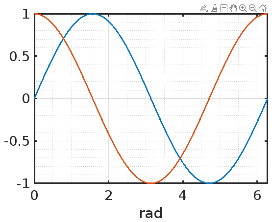

# MATLAB Markdown Writer - Example

This example generates a simple markdown file directly from Matlab and will also include figures, tables, structs and arrays that will be properly formatted in markdown.

To see how this file is created please see **Examples/example.m** from within Matlab

## Adding figures

To add figures simply call the *AddFigure()* functions. the figure will be written as .png file to the images sub directory with a prefix of the markdown file name



```matlab
md.AddFigure(gcf, 'fig1'); % fig1 = figure file name
```

All figures and axes will be automatically styles based on the **layout.figure** and **layout.axes** properties of the Markdown class. These properties are a structs and all fields of those structs will directly overwrite the corresponding properties of the figure (and their corresponding axes) which are to be added to the markdown file

## Adding code

Although not the primary focus of this Mardown class you can also add matlab code directly from your scripts to the markdown file. Simply enclose the code you want to run and include in the markup between the **BeginCode()** and **EndCode()** functions

```matlab
a = 1;
b = 2;
c = a + b;
```

## Adding structs

Structs can easily be added as table by using the **AddStruct()** function. Lets create a struct and add it to the markdown.

```matlab
myStruct = struct();
myStruct.Name = 'Example struct';
myStruct.Property = {'Here', 'be', 2, 'dragons'};
myStruct.OtherProperty = 1;
myStruct.AnotherProperty = [1 2 3 4];
```

And render it to the markdown file using **AddStruct()**:

Property | Value
--- | ---
Name | 'Example struct'
Property | {'Here', 'be', 2, 'dragons'}
OtherProperty | 1
AnotherProperty | [1 2 3 4]

```matlab
md.AddStruct(myStruct);
```

## Adding arrays and matrices

To render matrices as tables use the **AddMatric()** function.

 []() |  1 |  2 |  3 |  4 |  5 |  6
 --- |  --- | --- | --- | --- | --- | ---
 **1** |  55 |  14 |  15 |  26 |  84 |  25

```matlab
a = round(rand(1,6)*100);
md.AddMatrix(a);
```

---

 []() |  1
 --- |  ---
 **1** |  81
 **2** |  24
 **3** |  93

```matlab
a = round(rand(1,3)*100).';
md.AddMatrix(a);
```

---

 []() |  1 |  2 |  3 |  4
 --- |  --- | --- | --- | ---
 **1** |  35 |  83 |  75 |  78
 **2** |  20 |  59 |  38 |  93
 **3** |  25 |  55 |  57 |  13
 **4** |  62 |  92 |  8 |  57
 **5** |  47 |  29 |  5 |  47
 **6** |  35 |  76 |  53 |  1

```matlab
m = round(rand(6,4)*100);
md.AddMatrix(m);
```

---

To add arrays as block quotes and not as a matric the **AddArray()** function can be used.

> 81, 24, 93


```matlab
md.AddArray(a);
```

